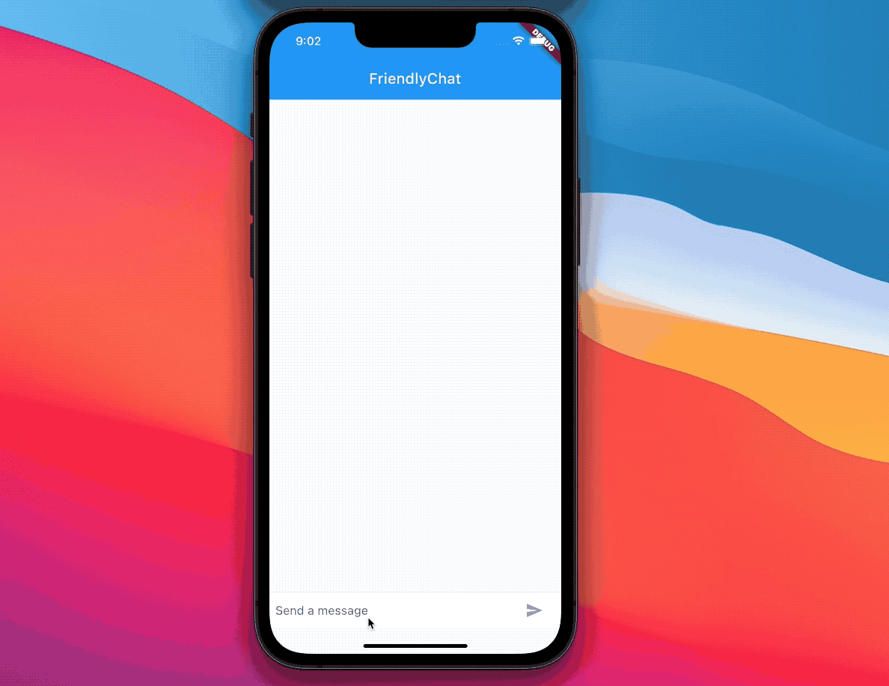

# friendly_chat

> Tutoriel proposé par Google (https://codelabs.developers.google.com/codelabs/flutter#0)

Une application simple qui simule un chat.

Le fichier GIF animé suivant montre le fonctionnement de l'application à la fin de cette partie de l'atelier :

